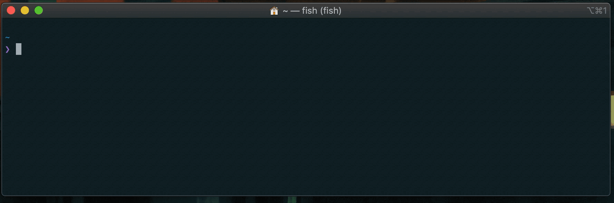

# ptail :trident:

[](https://crates.io/crates/ptail)
[](https://github.com/orf/ptail/actions)



`ptail` is a small, and likely useless, utility that truncates the output from processes. Unlike `tail -f` it will not 
show more than the specified number of lines in your terminal.

This could be useful if you are executing a command as part of a shell script and you do not wish to show the full and 
verbose output, but you do want to be able to see what is happening.

# Examples :star:

## Running a command

This will execute `brew bundle install --global` and only show the last 20 lines. The `--` is required to prevent 
`--global` being interpreted as part of the `ptail` command.

`ptail -n 20 -- brew bundle install --global`

## `tail -f` equivalent

If you don't specify a command it will read from stdin:

`tail -f /var/log/verbose-log | ptail -n 20`

# Install :cd:

## Homebrew (MacOS + Linux)

`brew tap orf/brew`, then `brew install ptail`

## Arch Linux

There is [an AUR package for `ptail`](https://aur.archlinux.org/packages/ptail/):

```
git clone https://aur.archlinux.org/ptail.git
cd ptail
makepkg -si
```

## Binaries (Windows)

Download the latest release from [the github releases page](https://github.com/orf/ptail/releases). Extract it 
and move it to a directory on your `PATH`.

## Cargo

`cargo install ptail`
